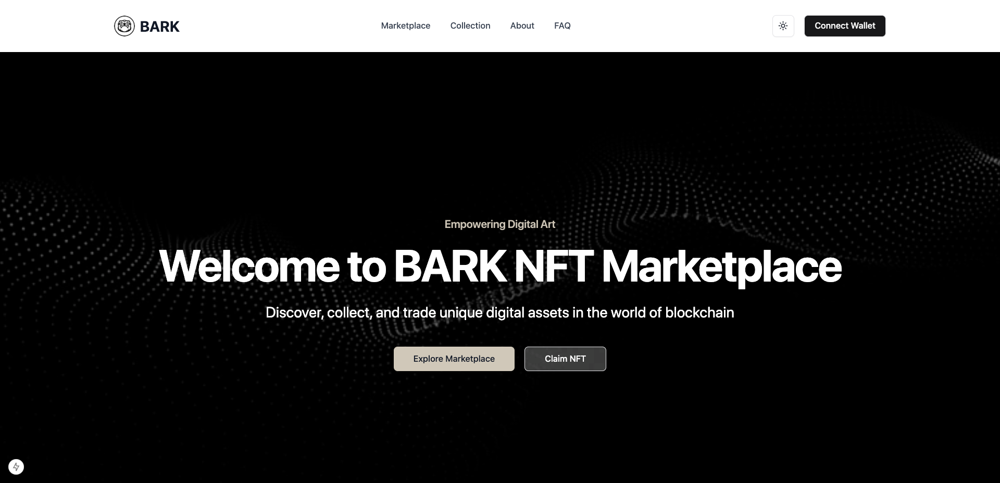

# BARK | NFT Marketplace (MVP)



BARK Protocol’s NFT marketplace and staking platform is built on the Solana blockchain, providing an innovative way for users to interact with digital assets. The platform allows minting, buying, selling, customizing, and staking NFTs with efficiency and creativity.

---

## Frontend

The frontend is a Next.js application written in TypeScript. It includes key components and pages for wallet integration, NFT marketplace, staking, and rewards claiming. The frontend communicates with the Solana blockchain using the Solana Web3.js library.

### Core Components

**Wallet Context:**
- Manages wallet connections and disconnections using the `@solana/wallet-adapter-react` library.
- Provides a context to share the wallet state across the application.
- Supports Phantom, Solflare, and Backpack wallets.

**NFT Staking Page:**
- Allows users to stake NFTs to earn rewards.
- Users connect their wallet, input the NFT mint address, and stake the NFT.
- A mock transaction is sent to the Solana blockchain as a placeholder for actual staking logic.

**Claim Rewards Page:**
- Allows users to claim rewards accumulated from staked NFTs.
- Rewards are transferred back to the user’s wallet in the form of fungible tokens.

**Wallet Connection Management:**
- Provides an interface for users to connect and disconnect from their wallets.
- Displays the wallet address once connected.

---

## Features

- **Mint Compressed NFTs or Standard NFTs**
- **Browse and Purchase Listed NFTs**
- **Stake NFTs to Earn Rewards**
- **User Profiles**: View owned NFTs and transaction history
- **Wallet Integration**: Supports Solflare, Metamask, Phantom, and Backpack
- **Responsive Design**: Built with Tailwind CSS and Shadcn/ui components

---

## NFT Staking System

The BARK NFT Staking System allows users to stake their NFTs, earn rewards in fungible tokens, and interact with the Solana blockchain through a simple, user-friendly web interface built with Next.js and TypeScript.

This system supports Solana wallet integrations (e.g., Phantom, Solflare, Backpack) and utilizes the Solana Web3.js library to manage blockchain interactions. The architecture is designed to be scalable, modular, and highly interactive, offering features such as staking NFTs, claiming rewards, and wallet integration.

---

## NFT Minting Process

### 1. **Create & Mint**
- Customize your NFT with a **title**, **description**, **royalties**, and text overlays.
- Choose between **standard** and **compressed NFTs**.
- Upload and personalize your NFT image directly in the interface.
- Mint **multiple NFTs** in a single transaction (up to 10).

### 2. **Quick Mint**
- Rapidly mint up to **100 NFTs** using pre-set configurations.
- Ideal for creating **larger collections** quickly.

### 3. **Image Customization**
- Upload your own images or use the default **BARK icon**.
- Add **background variations**, **text overlays**, and more.
- Preview your customized NFT before minting.

### 4. **Minting Progress**
- Real-time **progress bar** for tracking the minting process.
- Clear **success** and **error notifications** for a smooth experience.

### 5. **Social Sharing**
- Share your newly minted NFTs on **social media platforms**.
- Generate **Solana Pay links** for quick and easy NFT purchases.

### 6. **Claim Process**
- Seamlessly claim pre-allocated NFTs using **unique claim codes**.

---

## How It Works

1. **Creating an NFT**
   - Navigate to the "Create & Mint" tab.
   - Fill in details (title, description, royalties, type).
   - Upload and customize your image.
   - Set the quantity (1-100).
   - Click **"Mint NFT"** to begin.

2. **Quick Minting**
   - Go to the "Quick Mint" tab.
   - Select quantity and NFT type.
   - Click **"Quick Mint"** for instant minting.

3. **Claiming an NFT**
   - Access the "Claim" tab.
   - Enter your **unique claim code**.
   - Click **"Claim NFT"** to receive it.

4. **Social Sharing**
   - After minting, use sharing options to showcase your NFT.
   - Generate and share **Solana Pay links** for purchasing.

---

## Architecture

### Solana Blockchain Integration:
- **Solana Web3.js** is used for interacting with the Solana blockchain, allowing the frontend to mint NFTs, send transactions, and stake NFTs.
- **Anchor Framework** is employed for building smart contracts (programs) on Solana.
  
### Backend:
- The backend utilizes **Supabase** for storing user data and NFT metadata. Prisma ORM is used to interact with the PostgreSQL database.
- The **Anchor Program** handles NFT minting, staking, and rewards logic directly on the Solana blockchain.

### Staking and Rewards:
- NFTs can be staked to earn rewards, which are fungible tokens sent back to the user's wallet.
- Staking is handled via smart contracts deployed on the Solana blockchain.
  
### User Experience:
- The frontend is built using **Next.js** with **TypeScript** for type safety and **Tailwind CSS** for responsive design.
- **Shadcn/ui components** are used to simplify UI development and ensure consistency across the platform.

---

## Technologies Used

- **Next.js** 15.1.0 with App Router
- **React** 19
- **TypeScript**
- **Solana Web3.js**
- **Anchor Framework**
- **Prisma ORM**
- **Supabase** (PostgreSQL database)
- **Tailwind CSS**
- **Shadcn/ui components**
- **Lucide icons**

---

## Prerequisites

- Node.js (v18 or later)
- npm, pnpm, or yarn
- Solana CLI tools
- A Solana wallet (e.g., Solflare, Metamask, Phantom, Backpack)

---

## Installation

### 1. Clone the Repository
```bash
git clone https://github.com/bark-protocol/nft-marketplace.git
cd nft-marketplace
```

### 2. Install Dependencies
```bash
pnpm install
# or
yarn install
```

### 3. Set Up Environment Variables
Create a `.env.local` file and add:
```env
DATABASE_URL=your_supabase_postgres_url
NEXT_PUBLIC_SOLANA_RPC_HOST=your_solana_rpc_url
```

### 4. Run Database Migrations
```bash
npx prisma migrate dev
```

### 5. Build the Anchor Program
```bash
cd lib/programs/nft-marketplace
anchor build
```

### 6. Deploy the Anchor Program
Deploy to your desired Solana network (localnet, devnet, or mainnet-beta):
```bash
anchor deploy
```

---

## Usage

1. **Start the Development Server**
   ```bash
   pnpm run dev
   # or
   yarn dev
   ```

2. **Access the Application**
   Open your browser and navigate to `http://localhost:3000`.

3. **Connect Your Wallet**
   Use the **Connect Wallet** button in the header to link your Solana wallet.

4. **Explore the Marketplace**
   - Mint new NFTs
   - Buy or sell NFTs
   - Stake NFTs for rewards

---

## Prisma Configuration

1. **Install Prisma**
   ```bash
   pnpm install prisma --save-dev
   pnpm install @prisma/client
   ```

2. **Initialize Prisma**
   ```bash
   npx prisma init
   ```

3. **Generate Prisma Client**
   ```bash
   npx prisma generate
   ```

4. **Apply Migrations**
   ```bash
   npx prisma migrate dev --name init
   ```

5. **Test Prisma Client**
   Create a script (`scripts/test-prisma.ts`) and run:
   ```bash
   npx ts-node scripts/test-prisma.ts
   ```

---

## Contributing

We welcome contributions! Fork the repository and submit a pull request to help improve the platform.

---

## Documentation

![Project documentation]:(/document)

---

## License

This project is licensed under the **MIT License**.
```